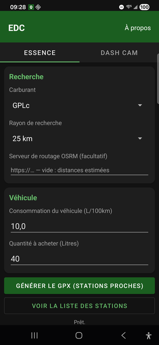
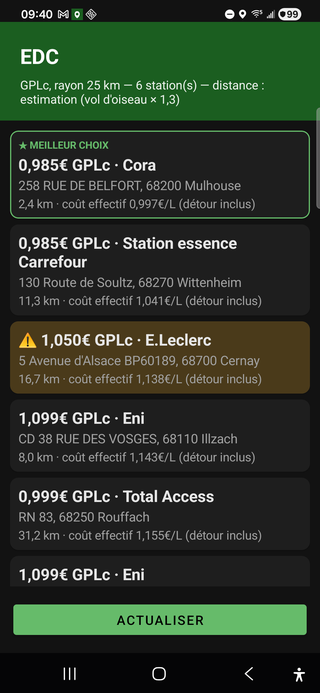
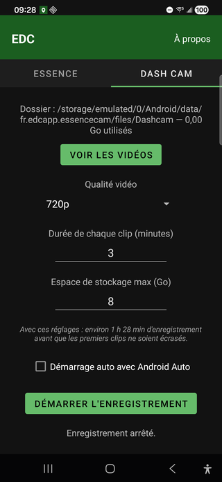
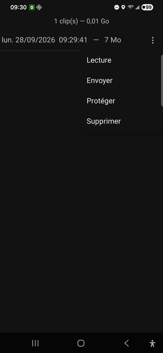
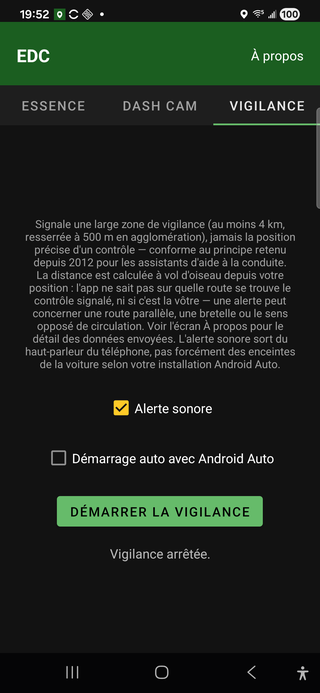
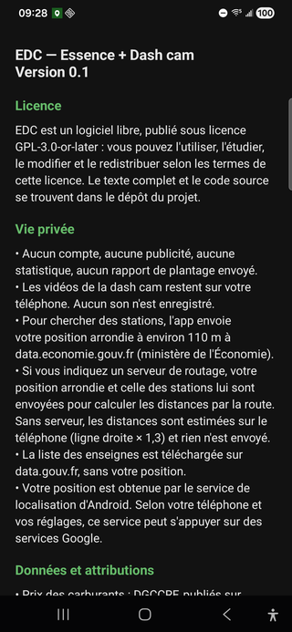

# EDC

**Essence au coût réel · Dashcam · Vigilance — libre, gratuit, sans publicité.**

*Essence + Dash cam*, à l'origine — GPL-3.0-or-later, sans compte ni pistage. Version 0.2 —
Android 8.0 et plus (testée à ce jour sur un Samsung Galaxy S22+, Android 16 ; les versions plus anciennes
d'Android n'ont pas encore été essayées).

**La station qui affiche le prix le plus bas n'est pas toujours la moins chère.** Exemple, pour une
consommation de 7 L/100 km et un plein de 50 L : une station à 1,789 €/L à 8 km, une autre à 1,799 €/L à
2 km seulement. Une fois le carburant brûlé pour le détour compté, la première revient à 1,829 €/L
réellement dépensés, la seconde à 1,809 €/L — moins chère malgré son prix affiché plus élevé. C'est ce
calcul qu'EDC fait pour vous, sur toutes les stations autour de votre position.

**[⬇ Télécharger la dernière version](https://github.com/Ixxs71/EDC/releases/latest)** — APK, hors Google
Play, licence GPL-3.0-or-later.

## 📱 Aperçu

<p>
     
</p>

## ⛽ Essence — le coût réel du plein

Cherche les stations-service autour de votre position pour un carburant donné (GPLc, gazole, SP95, SP98,
E10, E85) et les classe par **coût réel** : prix affiché plus carburant brûlé pour le détour aller-retour,
réparti sur la quantité que vous comptez acheter. Signale les prix dont la mise à jour est ancienne. Les
distances par la route sont estimées sur le téléphone (ligne droite × 1,3) ou, si vous indiquez l'adresse
d'un serveur OSRM, calculées par ce serveur. Crée un fichier GPX que vous ouvrez avec l'application de
cartes de votre choix, ou affiche la liste des stations : un tap sur une station ouvre votre application de
cartes centrée dessus, prête à lancer l'itinéraire.

## 📷 Dash cam — enregistrement en boucle

Enregistre la route avec la caméra arrière, sans son, en clips de durée fixe. Les clips les plus anciens
sont supprimés dès que le plafond d'espace choisi est atteint ; un clip peut être protégé pour ne jamais
être écrasé. L'écran affiche le temps d'enregistrement restant avant écrasement pour vos réglages.
L'enregistrement se met en pause si le téléphone chauffe trop, et reprend au refroidissement. Démarrage
manuel, ou automatique à la connexion d'Android Auto. Une liste intégrée montre les clips du plus récent
au plus ancien, avec lecture et envoi vers une autre application.

## 🚨 Vigilance — zone de contrôle de vitesse

Signale une large zone de vigilance (au moins 4 km, resserrée à 500 m en agglomération repérée) autour
d'un point de contrôle de vitesse connu — jamais sa position précise, conforme au principe retenu depuis
2012 pour les assistants d'aide à la conduite (Coyote, Waze...). La distance est calculée à vol d'oiseau
depuis votre position : l'app ne sait pas sur quelle route se trouve le contrôle signalé, ni si c'est la
vôtre. Démarrage manuel, ou automatique à la connexion d'Android Auto. Alerte sonore, désactivable.

## 🔒 Vie privée

**Pas de compte, pas de publicité, pas de statistiques, pas de rapport de plantage envoyé.** Le détail :

- Les vidéos restent sur le téléphone. Aucun son n'est enregistré.
- La recherche de stations envoie votre position **arrondie à environ 110 m** à `data.economie.gouv.fr`
  (rayon autour de vous).
- Les distances par la route sont **estimées sur le téléphone** : rien n'est envoyé. Si vous saisissez
  l'adresse d'un serveur OSRM (le vôtre, par exemple), votre position arrondie et celle des stations lui
  sont envoyées. Aucun serveur n'est imposé : l'instance de démonstration du projet OSRM est réservée à un
  usage raisonnable non commercial et ne convient pas à une application diffusée.
- Le référentiel des enseignes est téléchargé sur `data.gouv.fr`, sans position.
- Pendant que l'onglet Vigilance tourne, votre position arrondie est envoyée de temps en temps (au plus
  toutes les 2 minutes, ou si vous avez bougé de plus d'1 km) au service de géocodage de l'IGN
  (`data.geopf.fr`), uniquement pour resserrer la zone signalée en agglomération. Aucune adresse ni aucun
  résultat ne vous est montré.
- Votre position est obtenue par le service de localisation d'Android : aucune bibliothèque Google n'est
  embarquée. Selon votre téléphone et vos réglages, ce service peut s'appuyer sur des services Google.
- Un journal local (`events.log` : démarrages et arrêts de la dashcam, fournisseur de localisation utilisé)
  reste dans le stockage privé de l'app et n'est jamais envoyé. Il ne contient aucune position.

## Installation

1. Téléchargez l'APK sur la page [Releases](https://github.com/Ixxs71/EDC/releases/latest).
2. Ouvrez le fichier téléchargé et autorisez l'installation depuis cette source quand Android le demande
   (l'app n'est pas distribuée via Google Play).
3. Facultatif : suivez le dépôt avec [Obtainium](https://github.com/ImranR98/Obtainium) pour être prévenu
   des nouvelles versions.

## Permissions

| Permission | Pourquoi |
|---|---|
| Localisation (approximative) | Trouver les stations autour de vous. La position précise n'est pas demandée. |
| Caméra | Dash cam. Aucun micro n'est demandé. |
| Notifications | Statut de l'enregistrement, et notification « Dashcam désarmée » après un redémarrage ou une mise à jour. Demandée au démarrage de la dashcam ; sans elle, ces notifications ne s'affichent pas. |
| Réception du démarrage | Prévenir que la dashcam doit être relancée après un redémarrage ou une mise à jour. |
| Service de premier plan (caméra, localisation), Internet, état du réseau | Enregistrer ou surveiller avec l'écran éteint ; interroger les données ci-dessous. |

## Sources de données et licences

- Prix des carburants : DGCCRF, publiés sur `data.economie.gouv.fr` sous
  [Licence Ouverte v2.0 (Etalab)](https://www.etalab.gouv.fr/licence-ouverte-open-licence/).
- Enseignes des stations : « Référentiel des noms et enseignes de stations-service (enrichi par
  OpenStreetMap) », Chiffrex, sous licence ODbL — © Les contributeurs d'OpenStreetMap.
- Points de contrôle de vitesse (onglet Vigilance) : ministère de l'Intérieur, publiés sur
  `data.gouv.fr` sous licence LOV2.
- Géocodage inverse (onglet Vigilance, zone resserrée en agglomération) :
  [Géoplateforme IGN](https://data.geopf.fr/), licence etalab-2.0.
- Distances par la route, si vous utilisez un serveur [OSRM](https://project-osrm.org/) : données © les
  contributeurs d'OpenStreetMap (ODbL).
- Bibliothèques : AndroidX, Material Components, CameraX, kotlinx.coroutines (Apache-2.0).

## Compiler

JDK 17 ou plus, Android SDK (compileSdk 36).

```
./gradlew testDebugUnitTest   # tests unitaires
./gradlew assembleDebug
```

## Licence

GPL-3.0-or-later, voir [LICENSE](LICENSE). Chaque fichier source porte son identifiant SPDX.

## ❤️ Soutenir le projet

EDC est développé bénévolement, sur mon temps libre, et reste gratuit, sans publicité et sans compte. Si vous l'utilisez régulièrement et voulez aider à le faire durer, un pourboire — quelques euros — via [GitHub Sponsors](https://github.com/sponsors/Ixxs71) est bienvenu, jamais obligatoire. Aucun paiement ne passe par l'app.

## Signaler un problème

Ouvrez un ticket sur ce dépôt en indiquant la version de l'app, le modèle de téléphone et la version d'Android.
